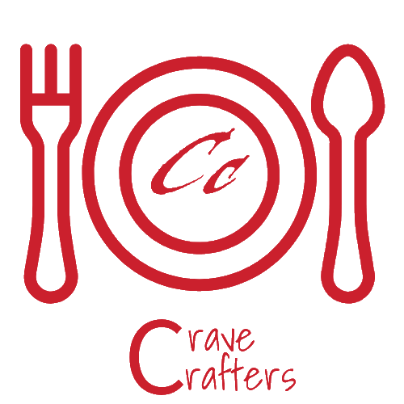

<p align="center">
  
</p>

# 🍽️ CraveCrafters - AI-Powered Food Ordering & Chatbot System

## 📌 Project Overview
CraveCrafters is an AI-powered food ordering web application that seamlessly integrates a chatbot to assist users with menu browsing, order placement, and customer service. The system features a **Node.js** backend, a **FastAPI-based chatbot**, and an interactive **frontend** built with HTML, CSS, and JavaScript. The application also utilizes **MongoDB** as its primary database for storing user details, menu items, and order information.

## 🚀 Features
✅ AI Chatbot for Menu & Order Assistance  
✅ User Authentication & Profile Management  
✅ Intuitive Cart & Checkout System  
✅ Dynamic Food Menu with Recommendations  
✅ Order History & Tracking  
✅ Interactive UI with Bootstrap & FontAwesome  
✅ MongoDB for Efficient Data Storage  

## ⚙️ Tech Stack
### 🌐 Frontend
- **HTML, CSS, JavaScript** for a responsive and interactive UI.
- **Bootstrap & FontAwesome** for styling and icons.
- **Dynamic elements** for menu display and cart management.

### 🖥️ Backend
- **Node.js (Express.js)** for handling API requests and user authentication.
- **FastAPI (Python)** for chatbot integration and order processing.
- **RESTful API** for seamless communication between frontend and backend.

### 🛢️ Database
- **MongoDB** as the primary database for:
  - Storing user credentials and profile information.
  - Managing restaurant menu items and categories.
  - Handling order history and transaction details.

## 📂 Folder Structure
Here’s an organized view of the project:

```
├── chatbot
│   ├── main.py
├── node_modules
├── public
│   ├── css
│   ├── images
│   ├── js
│   ├── uploads
├── views
│   ├── About.html
│   ├── Cart.html
│   ├── Home.html
│   ├── index.html
│   ├── Login.html
│   ├── Signup.html
│   ├── Orders.html
│   ├── profile.html
├── .env
├── .gitignore
├── dish_similarity.json
├── ML.py
├── package.json
├── package-lock.json
├── server.js
```

## 🏗 Installation & Setup
Follow these steps to set up and run the project locally:

### 1️⃣ Clone the Repository
```sh
git clone https://github.com/RahulRmCoder/CraveCrafters-Food-App.git
cd CraveCrafters-Food-App
```

### 2️⃣ Install Dependencies
```sh
npm install
```

### 3️⃣ Set Up Environment Variables
Create a `.env` file and configure necessary API keys and settings.

### 4️⃣ Run the Node.js Backend Server
```sh
node server.js
```

### 5️⃣ Start the Chatbot (Python Backend)
```sh
python chatbot/main.py
```

## 🎯 Usage Guide
1. Open the web application in your browser.
2. Sign up or log in.
3. Browse the menu or interact with the chatbot for recommendations.
4. Add items to your cart and proceed to checkout.
5. Track your orders via the profile section.

## 🤝 Contributing
We welcome contributions! Feel free to submit issues or pull requests.

## 📜 License
This project is licensed under the MIT License.
